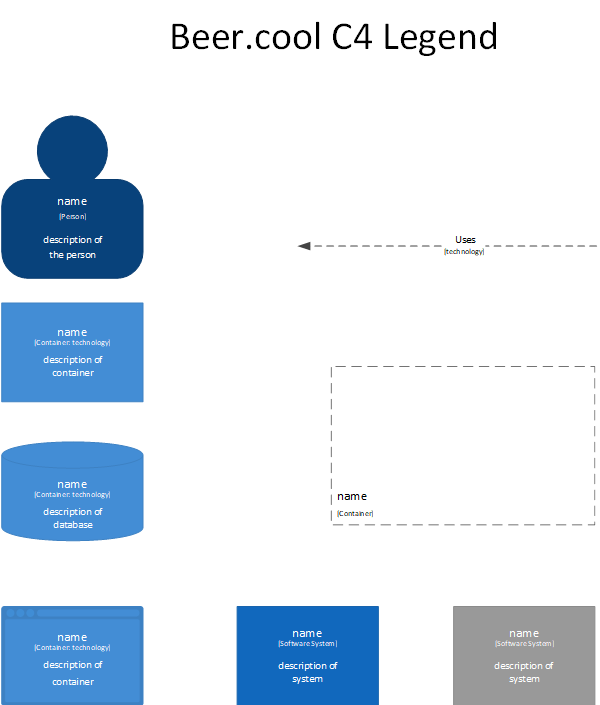
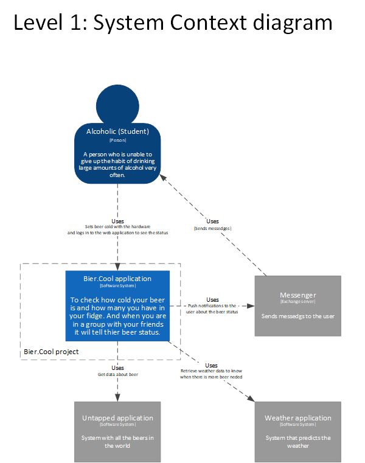
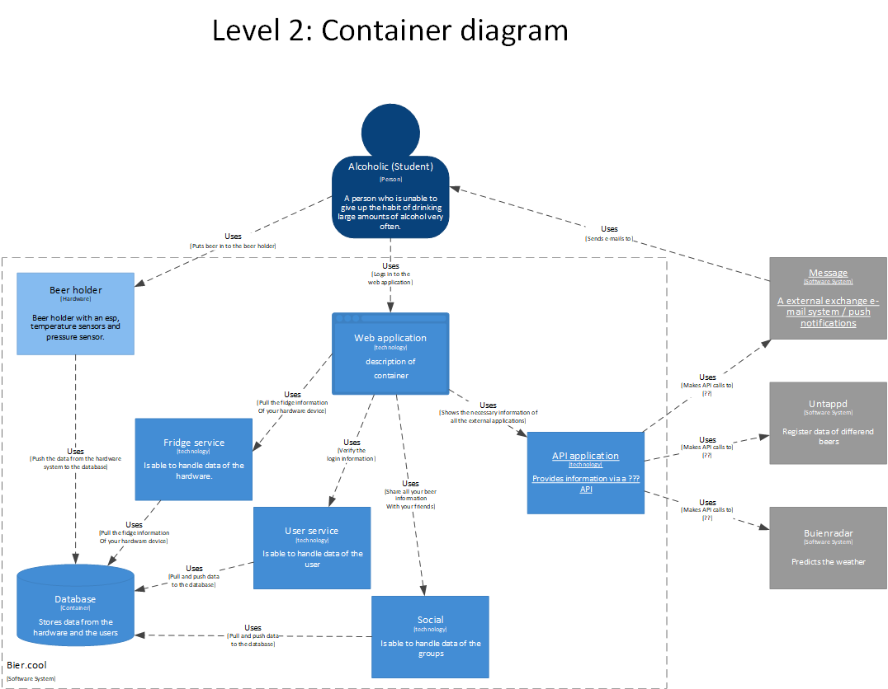
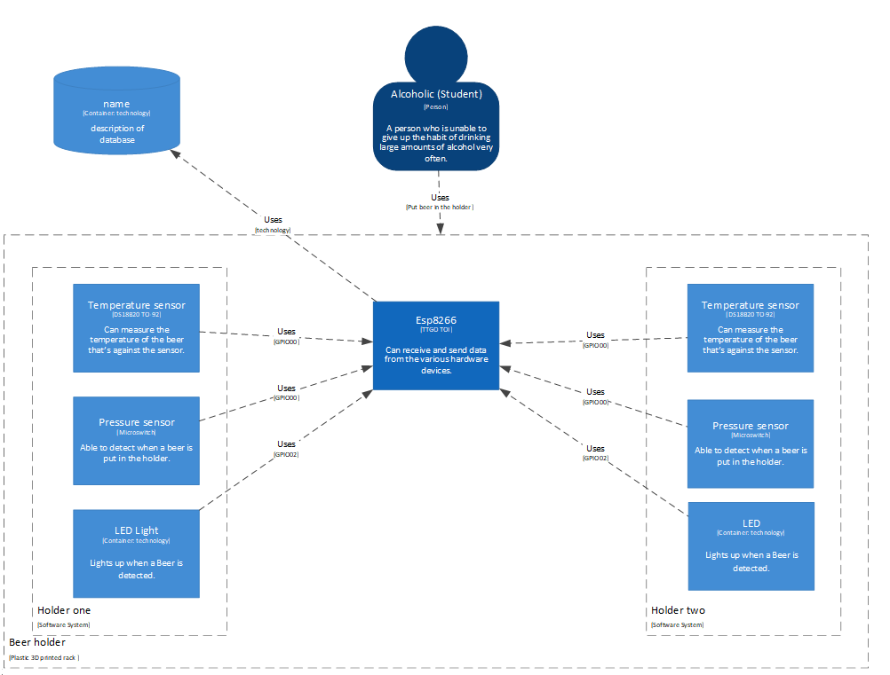

# C4 Model Bier.cool (/ analyse?)

In this small document, the C4 model for bier.cool ia explained.  

## Legend

Just a simple legend explaining all the different roles in the models.

## C1

Where we show the bigger scope of the project. It shows the various systems used in the project, the main one being the 
bier.cool system. The other systems are processes that operate with the main system.

## C2

Shows how we are going to implement a micro-service architecture to realise our plans. The Alcoholic only uses the beer 
holder and the web application. The API application is able to communicate with the external processes from level 1.

## C3

as of yet unfortunately still not in existence.

[comment]: <> ()

## C Hardware

While we know it is unusual to sketch a hardware project like this, we wanted to keep with the theme of the C4 model,
as well as it shedding at least some light on the design.