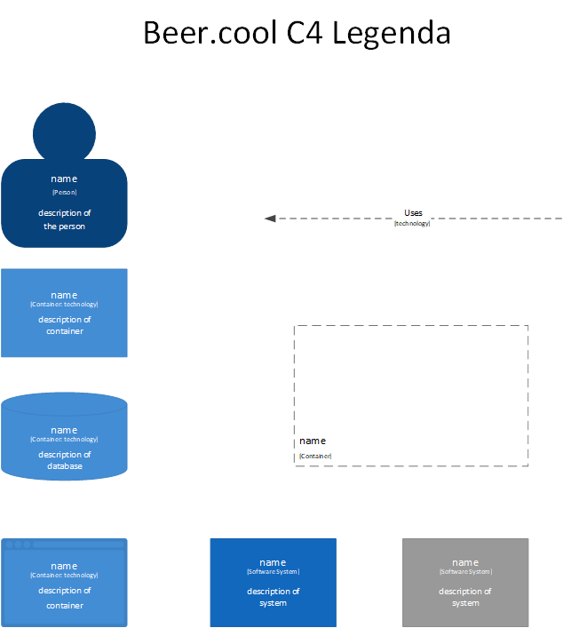

# C4 Model Bier.cool (/ analyse?)

In this small document, the C4 model for bier.cool.  

## Legend  

## Hardware

My first PoC is a small experiment with the DS18B20 Thermometer. I have decided to divide the folders into "code" and 
"pics". Pics can be ignored as they're just the pictures I used in the PDF. I have decided to not include any code in the "experiment" PDF, 
as they can be found in the "code" folder. 

