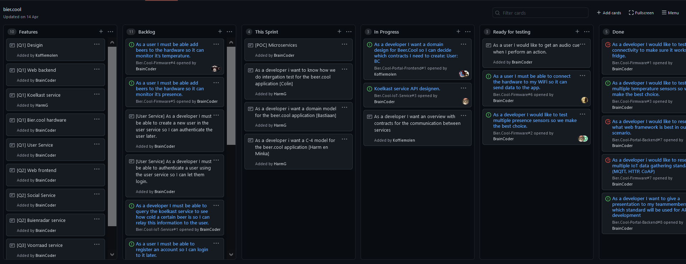
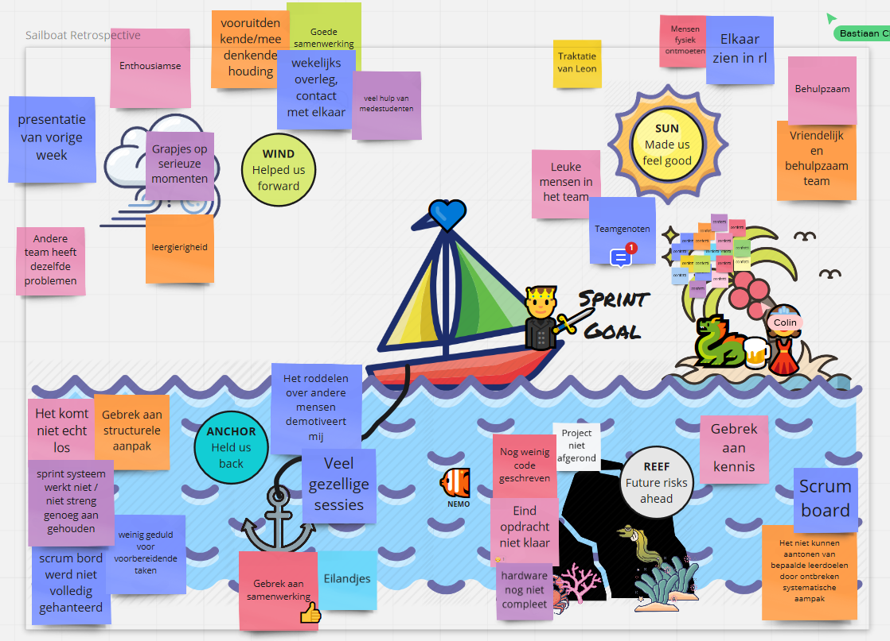

# Proof of Concept Ontwikkelmethodieken
# Minka Firth S3

I wasn't really sure how it would go, working in a group, with other people. It was the first time I ever had to work together on a programming project. While I had heard of "agile sprints", I wasn't really sure what to expect.

We started this semester with sprints of two weeks. 

We used Git to make a sort of kanban board:  It wasn't a proper kanban board, but we made some stories for each sprint and divided these into different colums such as, this sprint, in progress, ready for testing and done. 

It didn't work however, as planned. We are not sure if we weren't strict enough in our deadlines, or if the system itself wasn't very applicable to our project. We decided to plan a retrospective (very late albeit), and we realised we all felt the same about our system: it didn't work.  

We decided to use a new method, which took a lot of effort to set up everything properly, but did work a lot better than the git kanban board. 

**V-Model**

During the retrospective we realised we should be applying the V-model as well. We decided that we needed some Definition of Done and Definition of Acceptance. So we applied those to our new Kanban board. Instead of just assigning sprint-jobs to team members, we made sure each would have a proper User story with a Definition of Acceptance. An example can be found in [analyse](https://github.com/LittleMinks/Semester3/tree/main/PoC/LD.02%20Analyse). 

The definition of Acceptance is a list of criteria that can assume whether the feature suffices for the user story associated with it. The definition of Done is more a question if it's releasable. That means it meets all the acceptance criteria, has been acceptance-, unit-, and integration tested, there has been a code review, and finally, has been committed to the release branch. 

At first the V-model sort of confused me, as I was used to a very strict waterfall planning, it took some research before I realised why I prefer the V-model. I always felt like waterfall-model is very rigid, while the V-model is more flexible. For all it's planning in the design phase in waterfall planning, I feel more prepared when applying the V-model. Because you have to plan your testing parallel to your corresponding design, it gives me a better expectation of what to expect.  

