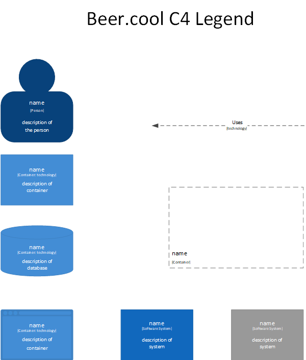

# Design

In this small document, the C4 model for bier.cool is explained.  

## C4 model

### Legend

Just a simple legend explaining all the different roles in the models.

### C1

Where we show the bigger scope of the project. It shows the various systems used in the project, the main one being the 
bier.cool system. The other systems are processes that operate with the main system.

## Log in 

**User Story**  
As an alcoholic I want to be able to log in with my username and password so that the system can authenticate and I can trust it. 

**Acceptance criteria**  

1. If I go to the login page and enter my username and password, and click the login button, my data should be accessible to me. 
2. If I go to the login page and enter the wrong username and password, and click the login button, login will fail and give a http status code 401.  

**Acceptance testing**

| **code** 	| **instruction**                                                    	| **expected result**                                                                                                                  	| **actual result** 	| **passed?** 	|
|----------	|--------------------------------------------------------------------	|--------------------------------------------------------------------------------------------------------------------------------------	|-------------------	|-------------	|
| *LG0*    	| Enter website's url "bier.cool" into the browser.                  	| Shows website's "homepage".                                                                                                          	|                   	|             	|
| *LG01*   	| Log in with username "minkasbier69" and password "islekkerkoud420" 	| Shows Minka's List of beers in fridge, with their temperature + List  of groups / List of friends.                                   	|                   	|             	|
| *LG01a*  	| Log in with username "minkasbier69" and no password.               	| Will not allow a user to log in without password.                                                                                    	|                   	|             	|
| *LG01b*  	| Log in with username "minkasbier42" and password "islekkerkoud420" 	| Will tell user that username does not exist.                                                                                         	|                   	|             	|
| *LG01c*  	| Log in with username "minkasbier69" and password "isviesbah420"    	| Will direct to http status code 401.                                                                                                 	|                   	|             	|
| *LG02*   	| Select one of the groups.                                          	| Will show friends in this group, sorted by the coldest beer + temp of beers.                                                         	|                   	|             	|
| *LG03*   	| Select one of the friends (from homepage or from a Group)          	| Will show friend's page with: beers + temp & sort of beer, distance to this friend + temp of beer when arriving, weather at friends. 	|                   	|             	|

