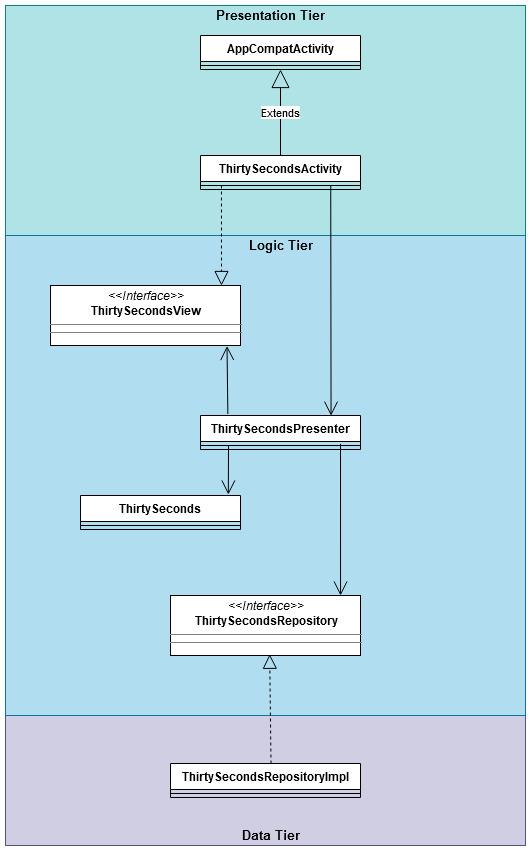

# Proof of Concept OO technieken

## Modularity

Last semester I worked on an Android 30 Seconds application. I divided this  application into three different modules, a presentation layer, a business layer and a data layer. I made sure all these were true to SOLID, especially the Dependency inversion. 

## Loose coupling

The best example I can think of is the research I did for the Design Patterns. We were comparing the observer pattern with the Pub-Sub Pattern. It mentioned that the observer pattern was more tightly coupled than the Pub-sub Pattern. I wasn't really sure anymore what the difference was, so I looked it up. In the case of the Observer Pattern, the subject and the observer are highly depended on each other. They have to know about each other's existence, otherwise the subject doesn't know where to send his "updates". In the case of the Pub-sub, the Publisher and Subscriber are separated by an "event bus" and they don't know about each other. 

By applying loose coupling, there is more room for expending or maintaining the code. It also allows for other important standards a programmer should try to keep to, such as; Single Responsibility and seperation of concerns. 

