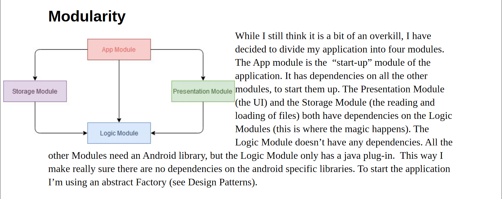
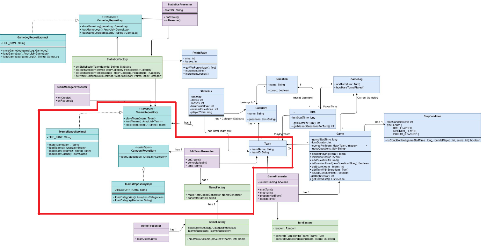
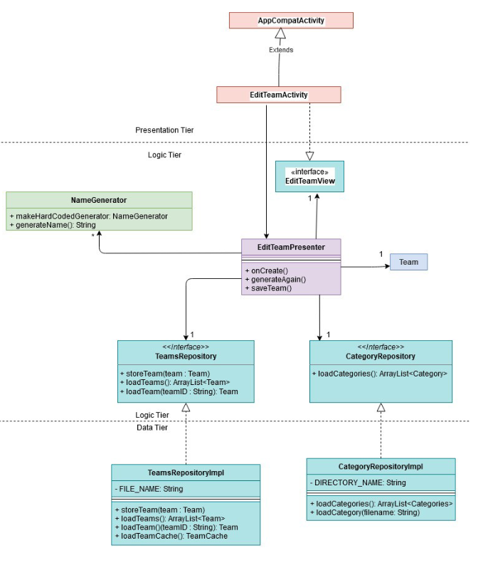

# Proof of Concept OO technieken

## Modularity

Last semester I worked on an Android 30 Seconds application. I divided this  application into four different modules, a presentation layer, a business layer and a data layer and a "start-up" module. I actually thought this was a bit of an overkill for such a small application. I wanted to have three modules, with the presentation module serving as a start-up module, but that would mean there would be a dependency from the presentation layer to the storage layer but apparently that really was simply not done. 

## Loose coupling

I know this might not make a whole lot of sense, but I am going to add it anyway to give an idea of my project last year. The blue classes are the data classes and the light green ones the actual behavioural classes. The purple and teal coloured classes where the Presenters and storages classes respectively. In the next diagram I will be zooming in on the area in the red border. 

The diagram above can be divided into several of diagrams of "Presenter-clusters", as I like to call them. To avoid dependencies between the different modules, I used the MVP design pattern. If there were dependencies between classes, they would be going inward and not outward. 

