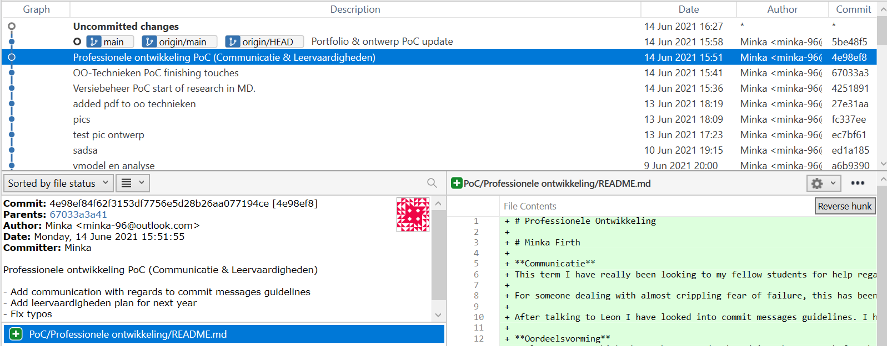

# Proof of concept Versiebeheer
# Minka Firth
## Commit Messages Conventions

So I did some research on commit messages guidelines. I found a bunch of different websites, but  they seemed to all agree on this format:

>Capitalized, short (50 chars or less) summary

>More detailed explanatory text, if necessary.  Wrap it to about 72
characters or so.  In some contexts, the first line is treated as the
subject of an email and the rest of the text as the body.  The blank
line separating the summary from the body is critical (unless you omit
the body entirely); tools like rebase will confuse you if you run the
two together.

>Write your commit message in the imperative: "Fix bug" and not "Fixed bug"
or "Fixes bug."  This convention matches up with commit messages generated
by commands like git merge and git revert.

>Further paragraphs come after blank lines.

>- Bullet points are okay, too

>- Typically a hyphen or asterisk is used for the bullet, followed by a
  single space, with blank lines in between, but conventions vary here

>- Use a hanging indent

This is the guideline I found on most sites. It seems to be the most conventional. I found this [link](https://gist.github.com/robertpainsi/b632364184e70900af4ab688decf6f53) to be the most helpfull one. 

## Commit to Master Branch

Okay I wanted to be sure and did some research. While I can see the benefit in not committing to master while working on a project with multiple people, I still do not see the benefit of it while working on a small document like my portfolio (which is why I haven't started new branches after talking to Leon).

I can understand that you want the master branch to be "clean" and used as the "releasable content" branch. When separating the branches in new fixes, updates, and adding features, it is easier to find mistakes in code (especially when everyone is keeping to the same commit message guidelines.)

