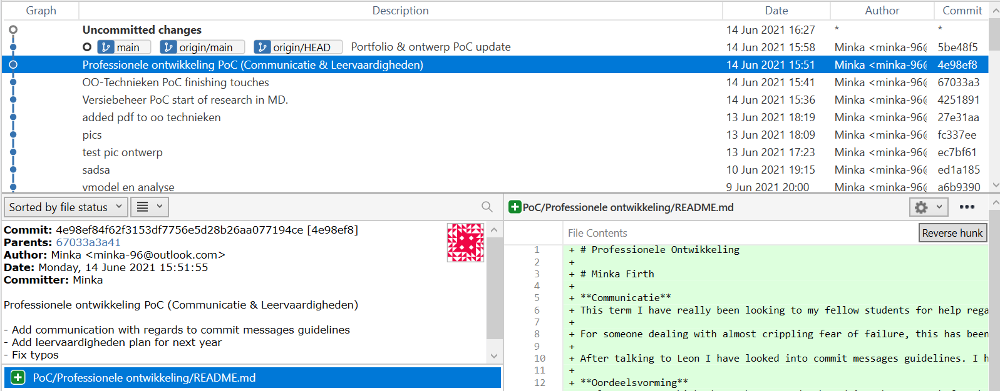

# Professionele Ontwikkeling

# Minka Firth

**Communicatie**  
This term I have really been looking to my fellow students for help regarding school. We have a lot of people with work experience in different areas, so there is always someone you can ask for help. It has also been very easy to ask for help. Whenever someone (often that someone would be me), would ask for more information, or a more detailed explanation, this was always received with enthusiasm and patience. 

For someone dealing with almost crippling fear of failure, this has been very comforting. While I am no longer afraid to ask for help, it is still quite daunting to admit I don't understand something as well as I should like. However, since it has never been received with exasperation or impatience, this has actually been going quite well.

After talking to Leon, I have looked into commit messages guidelines. I have actually been trying to keep to these. I can really understand why it is important to keep to these guidelines when working together in a group. Or even when working individually, because a repository can always be made public and other people might want to know what went through your mind when you committed these changes. 

**Oordeelsvorming**  
I always try to think about what I read. When doing the research for the design patterns, I found a few websites, all listing the same pros and cons for both the Observer and Pub-sub patterns. They would draw the same comparisons between them as well, they all had one source: Wikipedia. They even had the same alinea structure, and I noticed some metaphors and anecdotes reappearing. I knew there were two conclusions I could take from these websites:
* These comparisons will probably be quite factual and true.
* I won't find a single original thought in any of them.

I also think it's important to not simply choose the option "because everyone uses this *insert what you are discussing*". I don't think that's a valid argument. While there are some advantages to using something that a lot of people use, like there being a lot of documentation or tutorials available. I think it's more important that you choose something that is applicable to your project, and if it happens to be a popular framework (for example), that is just a nice bonus. 

**Leervaardigheden**  
This is still something I struggle with. I am going to try harder next semester. I am going to protect myself next semester and simply whenever I have a feedback conversation with a teacher, I am going to plan the next one for in like 2 or 3 weeks. This way I keep setting up deadlines for myself, meaning there is (admittedly, self-imposed) pressure on me to keep submitting work for feedback. 